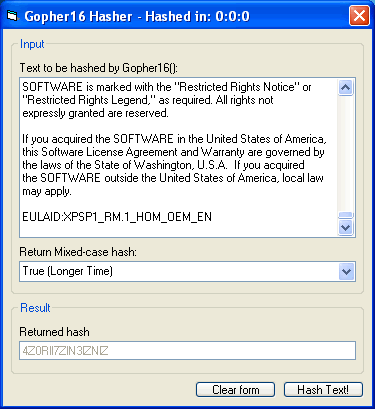



## Gopher16 hashing algorithm \(Version 2\)

### Description

--- Original description ---

Gopher16 has been designed to create a 128-bit hash of any data that is input into it. The main purpose of Gopher16 is to create hashes for passwords so that if your password store were to be compramised then the hacker wouldn't be able to see the actual password. They would just see the hash, which can't be turned back into the original password.

--- Additions ---

I have tried to make it a bit more secure and have update my coding to make it more readable adn presentable. Fully commented as all ways. Hope you like it.

Please note this hasn't been tested fully yet and any testing done by you and or suggestions are most welcome. Please vote if you like it.
 
### More Info
 

             |
---                |---
**Submitted On**   |2005-06-09 18:39:02
**By**             |[Ashley Bissell](https://github.com/Planet-Source-Code/PSCIndex/blob/master/ByAuthor/ashley-bissell.md)
**Level**          |Intermediate
**User Rating**    |5.0 (15 globes from 3 users)
**Compatibility**  |VB 5\.0, VB 6\.0
**Category**       |[Encryption](https://github.com/Planet-Source-Code/PSCIndex/blob/master/ByCategory/encryption__1-48.md)
**World**          |[Visual Basic](https://github.com/Planet-Source-Code/PSCIndex/blob/master/ByWorld/visual-basic.md)
**Archive File**   |[Gopher16\_h189908692005\.zip](https://github.com/Planet-Source-Code/ashley-bissell-gopher16-hashing-algorithm-version-2__1-61015/archive/master.zip)

